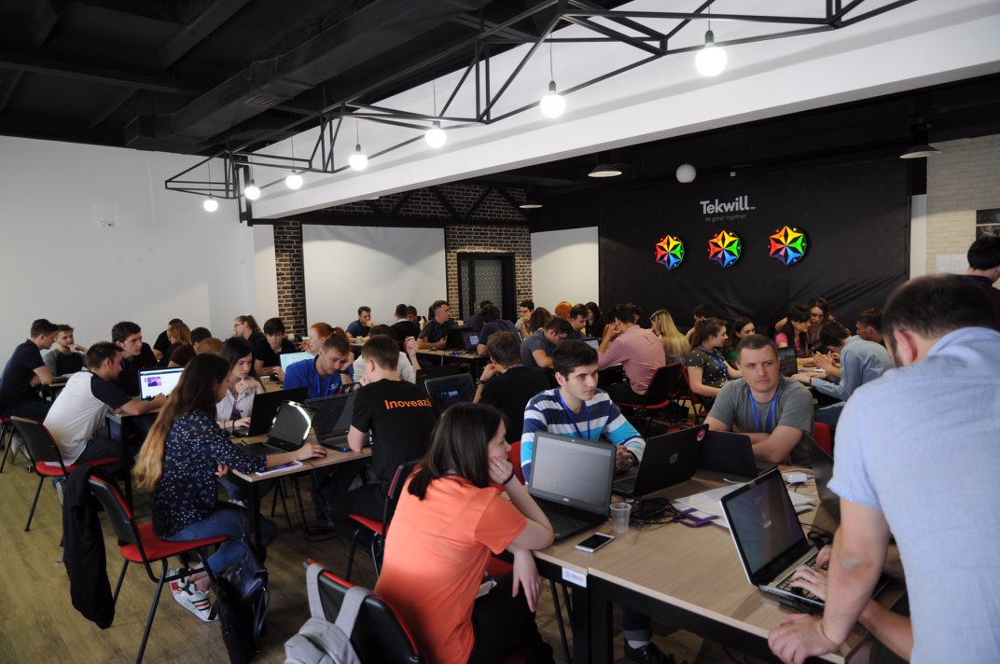
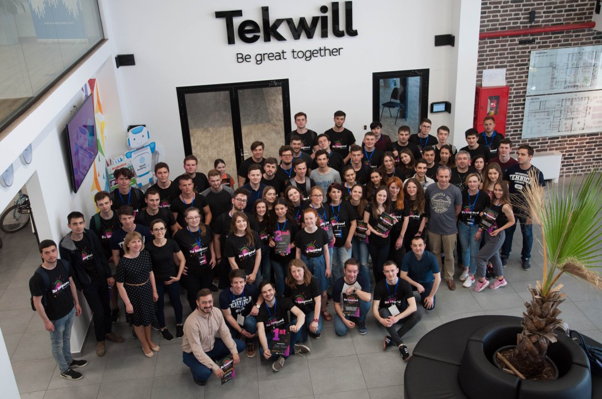
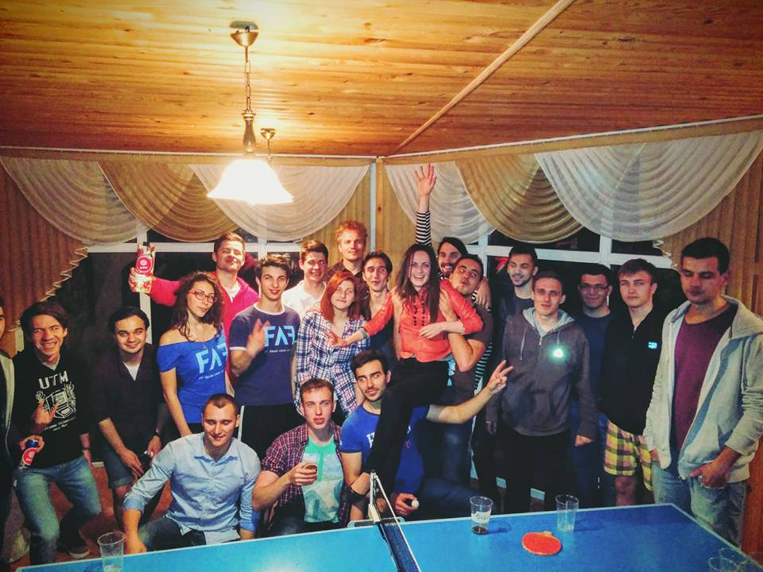
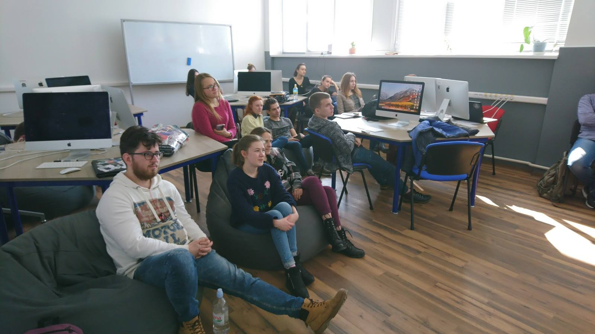

## FAF Hackathon

A hackathon is a design sprint-like event in which computer programmers and others involved in software development, including graphic designers, interface designers, project managers and others.

{:class="img-responsive"}

We organize FAF Hackathon twice a year and the goal is to bring together FAF students and alumni for working in teams and learning new technologies and developing programming skills.

{:class="img-responsive"}

<iframe width="650" height="450" src="https://www.youtube.com/embed/0b3ikmywb1k" frameborder="0" allow="autoplay; encrypted-media" allowfullscreen></iframe>

## FAF Party

FAF party is informal event exclusive for FAF students, its main goal is to consolidate FAF community, which at the moment is very large. FAF party gives possibility to new FAF-ers to discover previous FAF generations.

Our parties are organized twice per year, in autumn and spring, and these include only fun and distraction as dancing, socialization, playing games such as beer-pong and a lot of team games, listening, singing and playing at guitar. At FAF parties you can accumulate and share unique experience and hear or tell stories about real student life. FAF party is event which brings FAF together!

{:class="img-responsive"}

## FAF Lectures

FAF has a lot of students that are interested in extracurricular activities and studying. If someone is good or likes some specific topic he can share his knowledge through a presentation for others students. Presentations are usually at the beginner level with theoretical part about main concepts and demo. FAF Lectures are events with friendly conversations and jokes.

{:class="img-responsive"}
